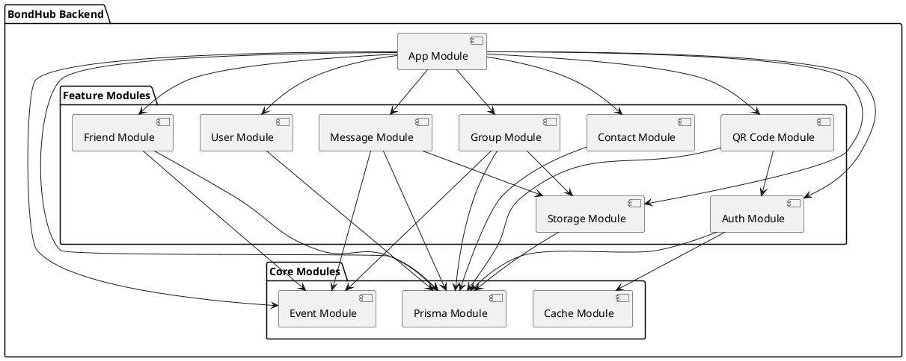
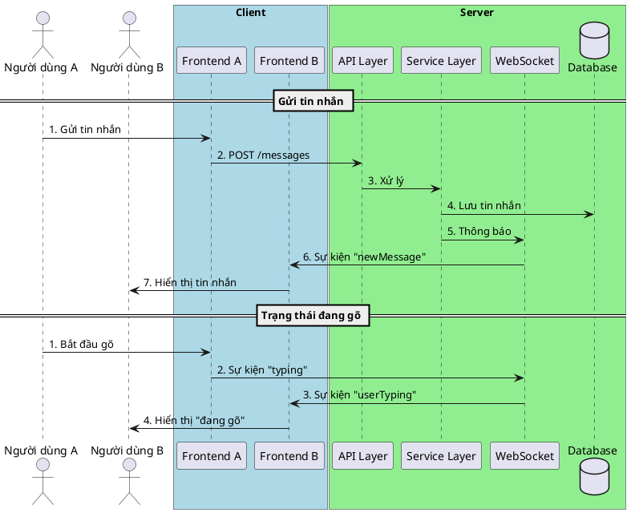
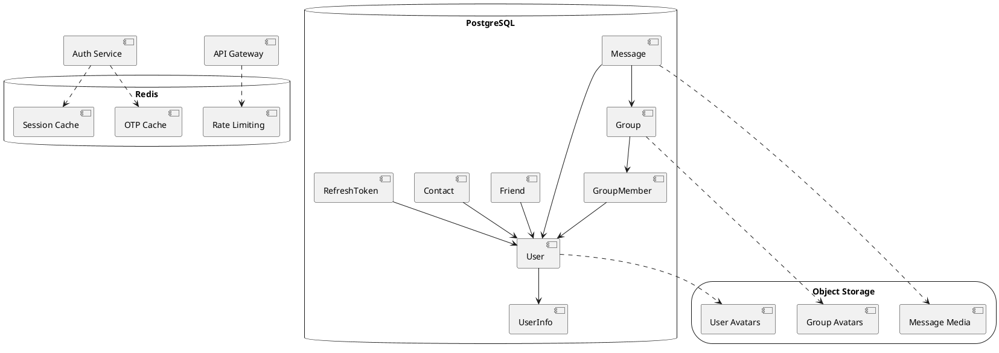
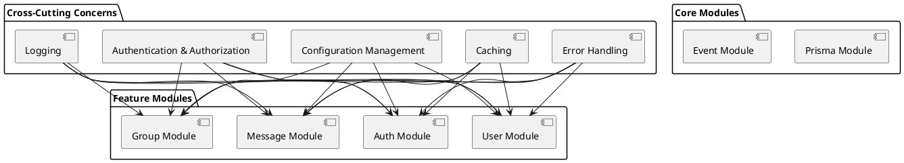

# Chương 2: Thiết kế Hệ thống

## 2.2. Kiến trúc Phần mềm

### 2.2.1. Tổng quan về Kiến trúc (Architectural Overview)

Hệ thống BondHub được thiết kế để đáp ứng các yêu cầu phi chức năng quan trọng sau:

- **Khả năng mở rộng (Scalability)**: Hỗ trợ số lượng người dùng và tin nhắn tăng trưởng theo thời gian
- **Hiệu suất (Performance)**: Đảm bảo độ trễ thấp cho giao tiếp thời gian thực
- **Bảo mật (Security)**: Bảo vệ dữ liệu người dùng và xác thực an toàn
- **Khả năng bảo trì (Maintainability)**: Cấu trúc module rõ ràng, dễ mở rộng
- **Độ tin cậy (Reliability)**: Đảm bảo tin nhắn được gửi và nhận một cách đáng tin cậy

Hệ thống được xây dựng theo mô hình kiến trúc **Client-Server kết hợp với Event-Driven Architecture**. Mô hình này được chọn vì:

1. **Client-Server** cung cấp sự phân tách rõ ràng giữa giao diện người dùng và logic nghiệp vụ, cho phép phát triển độc lập và bảo mật tốt hơn
2. **Event-Driven Architecture** hỗ trợ giao tiếp thời gian thực, cần thiết cho ứng dụng nhắn tin

```plantuml
@startuml Kiến trúc tổng quan
!include https://raw.githubusercontent.com/plantuml-stdlib/C4-PlantUML/master/C4_Container.puml

Person(user, "Người dùng", "Sử dụng ứng dụng để nhắn tin và quản lý nhóm")

System_Boundary(bondHub, "BondHub") {
    Container(frontend, "Frontend", "React Native, Zustand", "Giao diện người dùng trên thiết bị di động và web")

    Container(backend, "Backend", "NestJS, TypeScript", "Xử lý logic nghiệp vụ và API")

    ContainerDb(database, "Database", "PostgreSQL", "Lưu trữ dữ liệu người dùng, tin nhắn, nhóm")

    ContainerDb(redis, "Cache", "Redis", "Lưu trữ dữ liệu tạm thời, phiên làm việc")

    Container(storage, "Storage Service", "AWS S3/Minio", "Lưu trữ file, hình ảnh, video")
}

Rel(user, frontend, "Tương tác với")
Rel(frontend, backend, "Gọi API, kết nối WebSocket", "REST, WebSocket")
Rel(backend, database, "Đọc/ghi dữ liệu", "Prisma ORM")
Rel(backend, redis, "Lưu cache, phiên làm việc", "Redis Client")
Rel(backend, storage, "Lưu trữ/truy xuất file", "S3 API")

@enduml
```

### 2.2.2. Phân rã Hệ thống (System Decomposition)

Hệ thống BondHub được chia thành các module chức năng rõ ràng, mỗi module đảm nhận một trách nhiệm cụ thể:

#### Backend Modules

1. **User Module**: Quản lý thông tin người dùng, hồ sơ cá nhân
2. **Auth Module**: Xác thực, phân quyền, quản lý phiên làm việc
3. **Message Module**: Xử lý tin nhắn cá nhân và nhóm
4. **Group Module**: Quản lý nhóm, thành viên, quyền trong nhóm
5. **Friend Module**: Quản lý kết bạn, danh sách bạn bè
6. **Contact Module**: Quản lý danh bạ, tìm kiếm người dùng
7. **Storage Module**: Quản lý lưu trữ file, hình ảnh, video
8. **QR Code Module**: Xử lý đăng nhập và chia sẻ thông tin qua QR code
9. **Event Module**: Quản lý và phân phối sự kiện trong hệ thống
10. **Prisma Module**: Kết nối và tương tác với cơ sở dữ liệu
11. **Cache Module**: Quản lý bộ nhớ đệm với Redis



#### Mô tả chi tiết các module chính

1. **Message Module**
   - **Trách nhiệm**: Xử lý tất cả các chức năng liên quan đến tin nhắn
   - **Thành phần**:
     - MessageController: Xử lý các API request
     - MessageService: Xử lý logic nghiệp vụ
     - MessageGateway: Quản lý kết nối WebSocket cho tin nhắn thời gian thực
   - **Chức năng chính**: Gửi/nhận tin nhắn cá nhân và nhóm, đánh dấu đã đọc, thu hồi tin nhắn, gửi file đa phương tiện

2. **Group Module**
   - **Trách nhiệm**: Quản lý các nhóm chat và thành viên
   - **Thành phần**:
     - GroupController: Xử lý các API request
     - GroupService: Xử lý logic nghiệp vụ
     - GroupGateway: Quản lý kết nối WebSocket cho thông báo nhóm
   - **Chức năng chính**: Tạo nhóm, thêm/xóa thành viên, phân quyền, cập nhật thông tin nhóm

3. **Auth Module**
   - **Trách nhiệm**: Xác thực và phân quyền người dùng
   - **Thành phần**:
     - AuthController: Xử lý các API request
     - AuthService: Xử lý logic nghiệp vụ
     - AuthGateway: Quản lý kết nối WebSocket cho trạng thái xác thực
   - **Chức năng chính**: Đăng nhập, đăng ký, quản lý token, xác thực OTP

4. **Event Module**
   - **Trách nhiệm**: Quản lý sự kiện trong hệ thống
   - **Thành phần**:
     - EventService: Phát và lắng nghe sự kiện
   - **Chức năng chính**: Phân phối sự kiện giữa các module, đảm bảo giao tiếp không đồng bộ

### 2.2.3. Mẫu hình Tương tác và Giao tiếp (Interaction and Communication Patterns)

Hệ thống BondHub sử dụng hai phương thức giao tiếp chính:

#### 1. Giao tiếp đồng bộ qua REST API

- **Phương thức**: HTTP/HTTPS
- **Định dạng dữ liệu**: JSON
- **Xác thực**: JWT (JSON Web Token)
- **Sử dụng cho**: Các thao tác CRUD, đăng nhập/đăng ký, tải dữ liệu ban đầu

#### 2. Giao tiếp bất đồng bộ qua WebSocket

- **Phương thức**: WebSocket
- **Định dạng dữ liệu**: JSON
- **Xác thực**: JWT (qua handshake)
- **Sử dụng cho**: Tin nhắn thời gian thực, thông báo, trạng thái đang gõ, trạng thái online

#### 3. Giao tiếp nội bộ qua Event Emitter

- **Phương thức**: Event Emitter (NestJS)
- **Sử dụng cho**: Giao tiếp giữa các module trong backend



#### Namespace WebSocket

Hệ thống sử dụng nhiều namespace WebSocket để phân tách các loại kết nối:

1. **/message**: Xử lý tin nhắn thời gian thực
2. **/groups**: Xử lý thông báo nhóm
3. **/friends**: Xử lý thông báo bạn bè
4. **/auth**: Xử lý trạng thái xác thực
5. **/qr-code**: Xử lý quét mã QR

#### Quản lý phòng (Room) trong WebSocket

- Mỗi người dùng tham gia vào phòng cá nhân: `user:{userId}`
- Mỗi nhóm chat có một phòng riêng: `group:{groupId}`
- Khi thành viên được thêm/xóa khỏi nhóm, họ cũng được thêm/xóa khỏi phòng tương ứng

### 2.2.4. Kiến trúc Dữ liệu (Data Architecture)

Hệ thống BondHub sử dụng kiến trúc dữ liệu đa dạng, kết hợp nhiều loại lưu trữ:

#### 1. PostgreSQL - Cơ sở dữ liệu chính

PostgreSQL được chọn làm cơ sở dữ liệu chính vì:
- Hỗ trợ ACID, đảm bảo tính nhất quán dữ liệu
- Hỗ trợ mạnh mẽ các mối quan hệ và ràng buộc
- Hỗ trợ JSON/JSONB cho dữ liệu linh hoạt
- Khả năng truy vấn mạnh mẽ

#### 2. Redis - Bộ nhớ đệm và dữ liệu tạm thời

Redis được sử dụng cho:
- Lưu trữ mã OTP và dữ liệu đăng ký tạm thời
- Cache dữ liệu thường xuyên truy cập
- Quản lý phiên làm việc
- Hỗ trợ các tác vụ thời gian thực

#### 3. Lưu trữ đối tượng (S3/Minio) - File và media

Dùng để lưu trữ:
- Hình ảnh đại diện người dùng và nhóm
- File đính kèm trong tin nhắn
- Hình ảnh và video trong tin nhắn



#### Mô hình dữ liệu chính

1. **User & UserInfo**: Thông tin người dùng, hồ sơ cá nhân
2. **Message**: Tin nhắn với nội dung dạng JSON (hỗ trợ văn bản và media)
3. **Group & GroupMember**: Thông tin nhóm và thành viên với vai trò
4. **Friend**: Mối quan hệ bạn bè giữa người dùng
5. **Contact**: Danh bạ người dùng
6. **RefreshToken**: Token làm mới cho xác thực

#### Chiến lược quản lý nhất quán dữ liệu

- Sử dụng giao dịch (transaction) cho các thao tác phức tạp
- Áp dụng ràng buộc khóa ngoại để đảm bảo tính toàn vẹn tham chiếu
- Sử dụng Prisma ORM để quản lý truy cập dữ liệu an toàn

### 2.2.5. Các Khía cạnh Xuyên suốt (Cross-Cutting Concerns)

#### 1. Xác thực và Phân quyền

- **Xác thực**: Sử dụng JWT (JSON Web Token)
  - Access Token: Thời gian sống ngắn (30 phút)
  - Refresh Token: Thời gian sống dài (30 ngày)
- **Phân quyền**:
  - Sử dụng Guards trong NestJS
  - Kiểm tra quyền dựa trên vai trò trong nhóm (LEADER, CO_LEADER, MEMBER)

#### 2. Ghi log

- Sử dụng Logger tích hợp của NestJS
- Phân cấp log: ERROR, WARN, INFO, DEBUG
- Ghi log chi tiết cho các hoạt động quan trọng và lỗi

#### 3. Xử lý Lỗi

- Sử dụng Filters trong NestJS để xử lý ngoại lệ
- Trả về thông báo lỗi nhất quán với mã HTTP phù hợp
- Ghi log chi tiết về lỗi để dễ dàng debug

#### 4. Caching

- Sử dụng Redis làm bộ nhớ đệm
- Cache dữ liệu thường xuyên truy cập (danh sách cuộc trò chuyện, thông tin người dùng)
- Tự động làm mới cache khi dữ liệu thay đổi

#### 5. Quản lý Cấu hình

- Sử dụng ConfigModule của NestJS
- Biến môi trường cho các cấu hình khác nhau (dev, staging, production)
- Tách biệt cấu hình nhạy cảm (khóa API, mật khẩu) khỏi mã nguồn



### 2.2.6. Quan điểm Triển khai (Deployment View)

Hệ thống BondHub được triển khai sử dụng Docker và Coolify:

#### Môi trường triển khai

- **Container**: Docker
- **Orchestration**: Docker Compose
- **Platform**: Coolify (self-hosted PaaS)

#### Các thành phần triển khai

1. **API Container**: NestJS backend
2. **PostgreSQL Container**: Cơ sở dữ liệu
3. **Redis Container**: Bộ nhớ đệm
4. **pgAdmin Container**: Quản lý cơ sở dữ liệu (chỉ trong môi trường phát triển)

```plantuml
@startuml Triển khai
node "Coolify Server" {
  node "Docker" {
    node "API Container" as API {
      [NestJS Application]
    }

    database "PostgreSQL Container" as PostgreSQL {
      [PostgreSQL Database]
    }

    database "Redis Container" as Redis {
      [Redis Cache]
    }

    node "pgAdmin Container" as pgAdmin {
      [pgAdmin]
    }
  }
}

cloud "Object Storage" {
  [S3/Minio]
}

[NestJS Application] --> [PostgreSQL Database] : Prisma ORM
[NestJS Application] --> [Redis Cache] : Redis Client
[NestJS Application] --> [S3/Minio] : S3 Client
[pgAdmin] --> [PostgreSQL Database] : Management
@enduml
```

#### Chiến lược triển khai

- **CI/CD**: Tự động triển khai khi có thay đổi trên nhánh chính
- **Migration**: Tự động chạy migration khi khởi động container
- **Health Check**: Kiểm tra sức khỏe các dịch vụ trước khi khởi động API
- **Backup**: Sao lưu cơ sở dữ liệu định kỳ

### 2.2.7. Lý do và Đánh đổi trong Thiết kế (Design Rationale and Trade-offs)

#### 1. Chọn PostgreSQL thay vì NoSQL

**Lý do chọn**:
- Tính nhất quán và độ tin cậy của dữ liệu (ACID)
- Hỗ trợ mạnh mẽ các mối quan hệ và ràng buộc
- Khả năng truy vấn linh hoạt và mạnh mẽ
- Hỗ trợ JSON/JSONB kết hợp ưu điểm của cả SQL và NoSQL

**Đánh đổi**:
- Khả năng mở rộng theo chiều ngang (horizontal scaling) phức tạp hơn
- Yêu cầu schema cứng (được giảm thiểu bằng cách sử dụng JSONB)

#### 2. Kiến trúc Module hóa

**Lý do chọn**:
- Phân tách rõ ràng các chức năng
- Dễ dàng bảo trì và mở rộng
- Cho phép phát triển song song

**Đánh đổi**:
- Có thể dẫn đến overhead khi giao tiếp giữa các module
- Yêu cầu thiết kế interface rõ ràng giữa các module

#### 3. WebSocket cho giao tiếp thời gian thực

**Lý do chọn**:
- Độ trễ thấp cho giao tiếp hai chiều
- Tiết kiệm băng thông so với polling
- Hỗ trợ tốt cho các tính năng thời gian thực (typing, online status)

**Đánh đổi**:
- Phức tạp hơn trong việc quản lý kết nối
- Yêu cầu xử lý đặc biệt cho kết nối không ổn định
- Cần cơ chế fallback (long polling) cho môi trường không hỗ trợ WebSocket

#### 4. Event-Driven Architecture nội bộ

**Lý do chọn**:
- Giảm sự phụ thuộc trực tiếp giữa các module
- Dễ dàng mở rộng với các tính năng mới
- Cải thiện khả năng mở rộng và bảo trì

**Đánh đổi**:
- Khó theo dõi luồng thực thi hơn
- Có thể dẫn đến sự phức tạp trong debug
- Yêu cầu quản lý cẩn thận để tránh vòng lặp sự kiện

#### 5. JWT cho xác thực

**Lý do chọn**:
- Không trạng thái (stateless), giảm tải cho server
- Dễ dàng mở rộng với nhiều service
- Tích hợp tốt với WebSocket

**Đánh đổi**:
- Không thể thu hồi token trước khi hết hạn (giảm thiểu bằng thời gian sống ngắn)
- Kích thước token lớn hơn so với session ID
- Yêu cầu lưu trữ an toàn ở client
